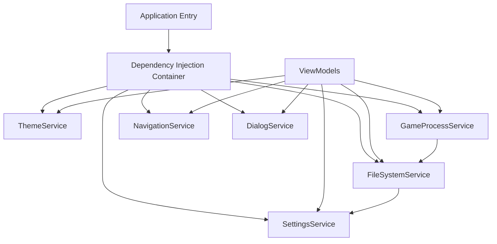
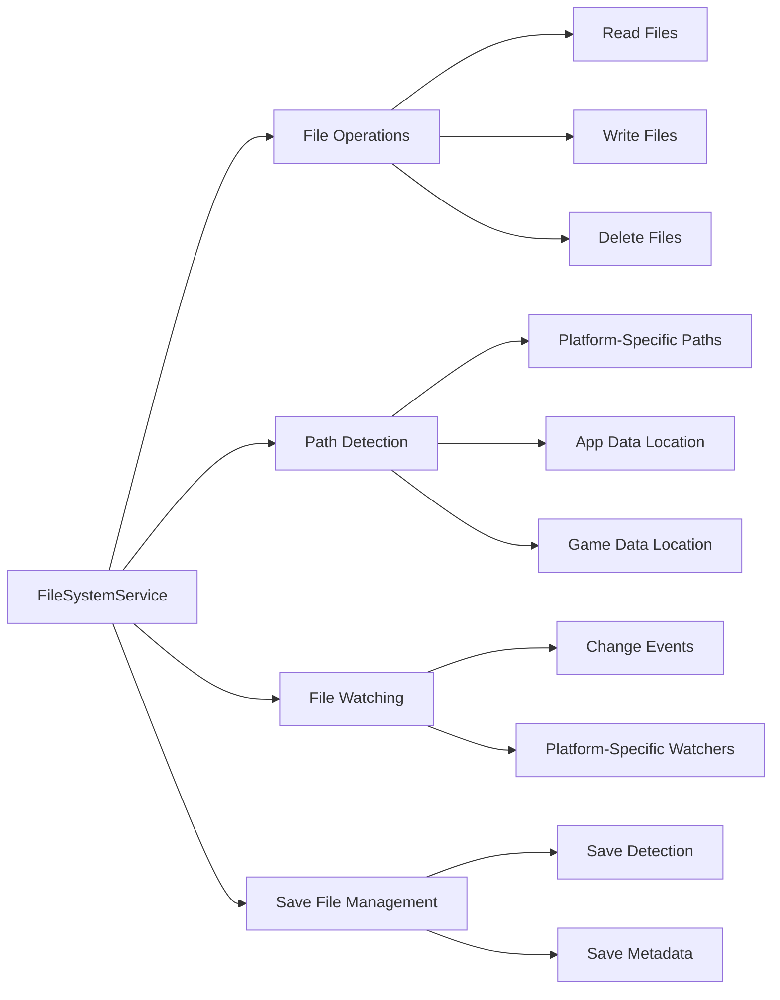
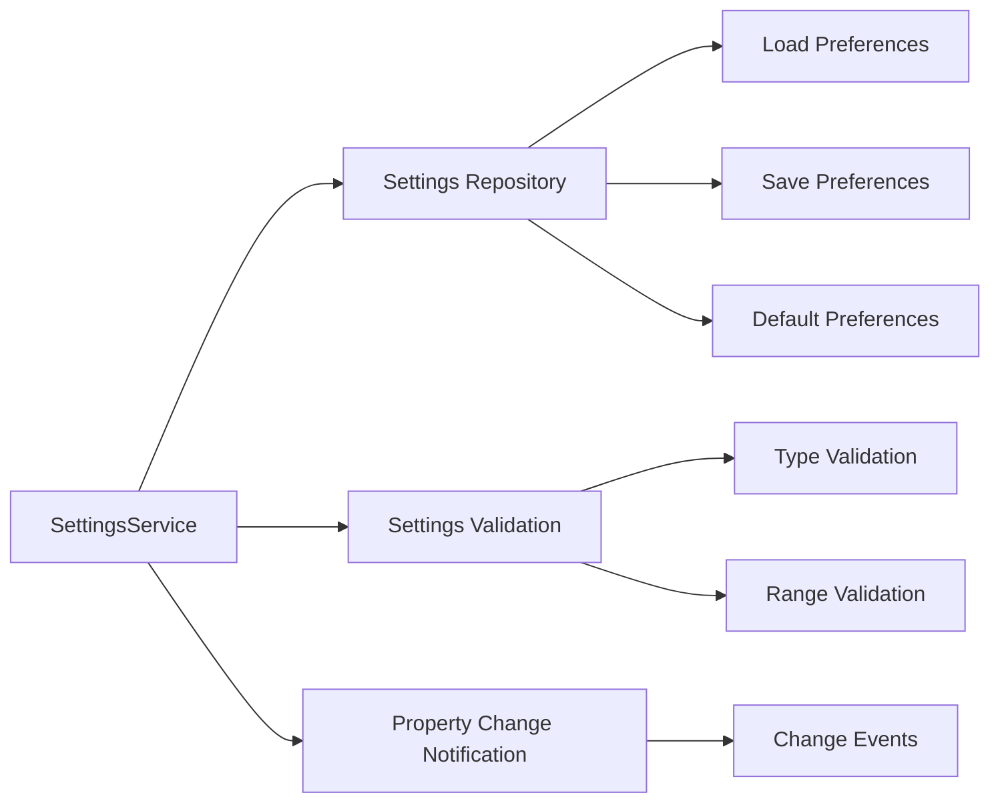
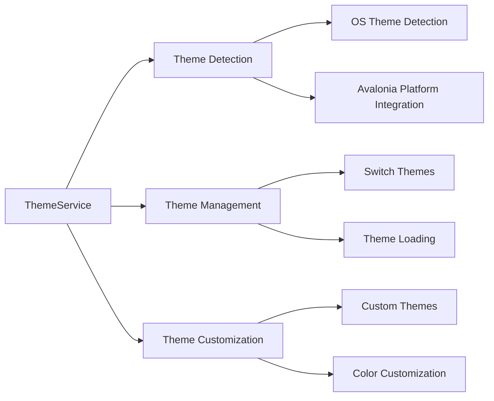
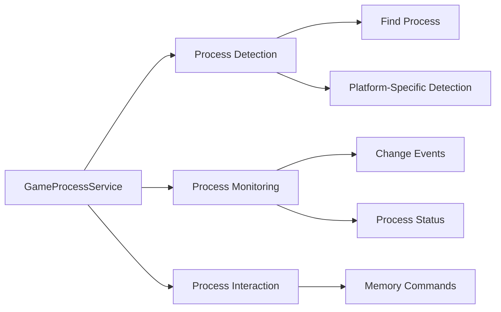
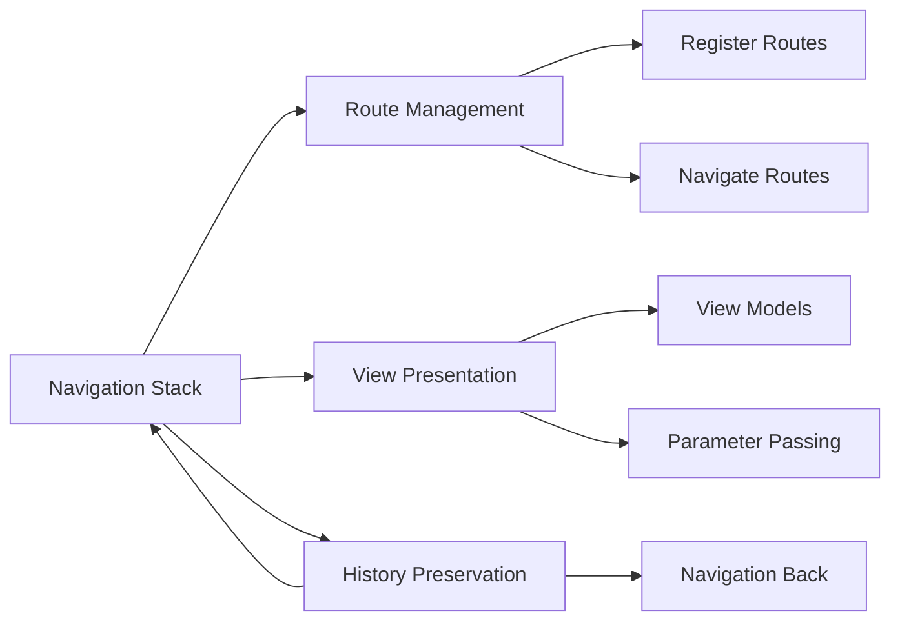
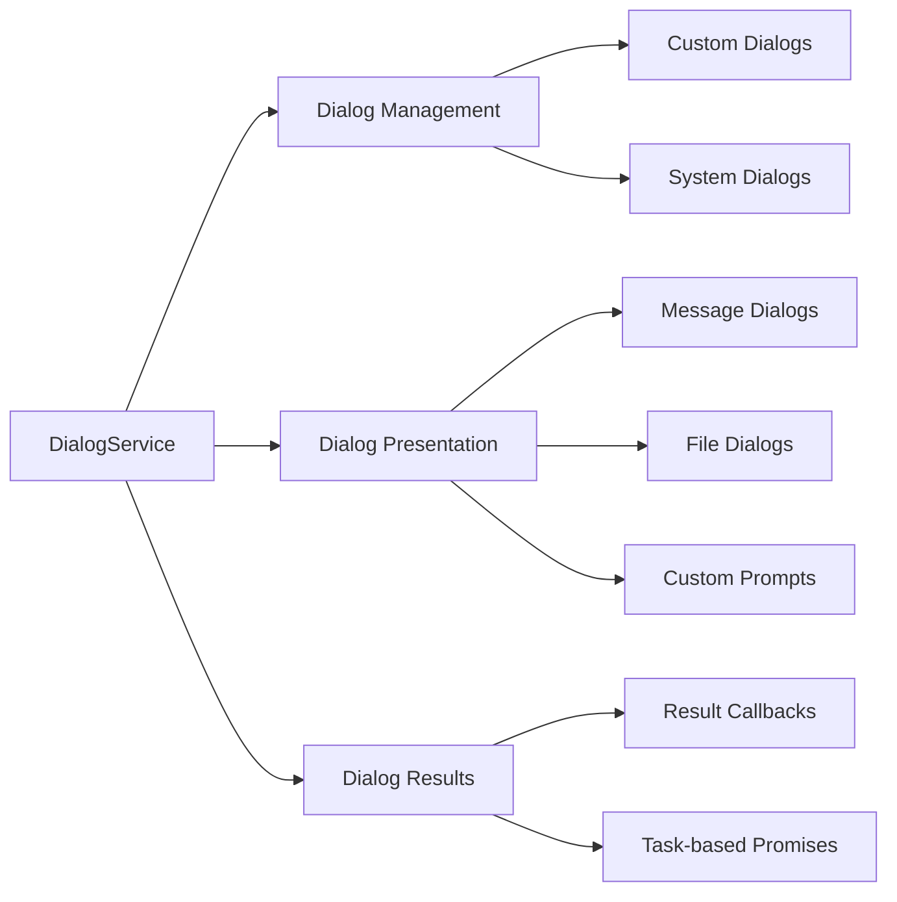
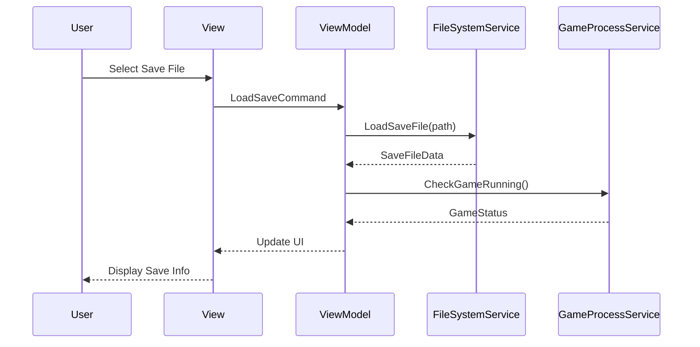
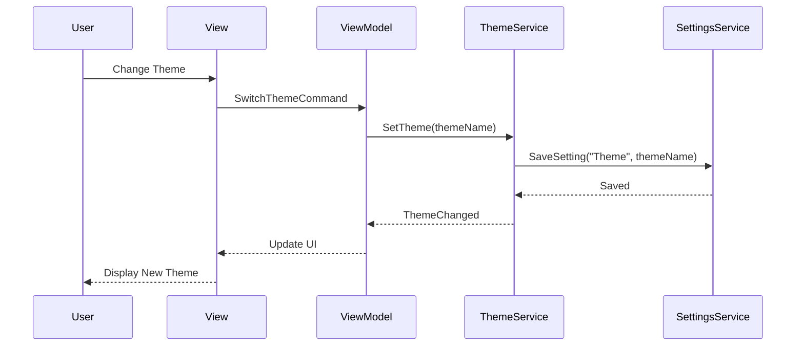

# Service Interaction Diagram

This document illustrates how the various services in the Balatro Save and Load Tool interact with each other and with the rest of the application.

## Service Dependency Flow

## Service Responsibilities

### FileSystemService

### SettingsService

### ThemeService

### GameProcessService

### NavigationService

### DialogService

## Sequence Diagrams

### Save File Loading

### Theme Switching

